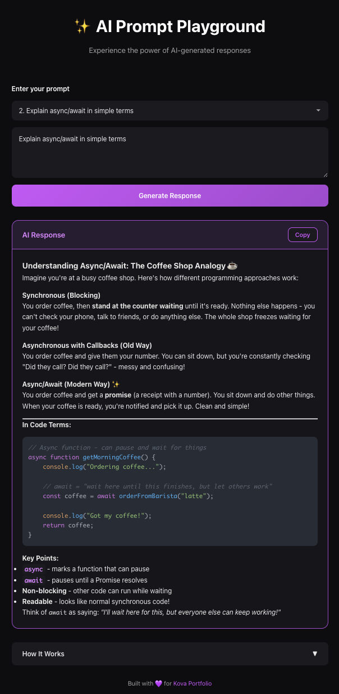

# 🤖 Kova's AI Playground

Interactive AI prompt playground with syntax highlighting and educational content.

## ✨ [**LIVE DEMO**](https://nightowlcoder.github.io/kova-ai-playground/)



 

---

## Features

- 🎯 **Interactive Prompt Interface** - Test AI prompts with realistic mock responses
- 💡 **Example Prompts** - Code generation, explanations, debugging, creative writing
- 🎨 **Syntax Highlighting** - Beautiful code display with highlight.js
- 📚 **"How It Works"** - Educational section explaining AI in simple terms
- ⚡ **Keyboard Shortcut** - Ctrl/Cmd+Enter to generate
- 💜 **Purple Neon Theme** - Kova brand aesthetic
- 📱 **Mobile Responsive** - Works on all devices
- ♿ **Accessible** - ARIA labels, keyboard navigation

---

## How to Use

1. **Select an example** from the dropdown or write your own prompt
2. Click **"Generate"** or press **Ctrl+Enter**
3. See the AI-powered response with syntax highlighting
4. Click **"How It Works"** to learn about AI prompts

**Example prompts included:**
- "Write a Python function to merge two sorted lists"
- "Explain async/await in simple terms"
- "Create a React todo component"
- "Debug: undefined is not a function"

---

## Tech Stack

- **Vanilla JavaScript** - No framework overhead
- **Highlight.js** - Code syntax highlighting (CDN)
- **CSS Custom Properties** - Easy theming
- **Mock Response System** - Pre-written realistic AI responses
- **XSS Protection** - Safe HTML rendering

### Why Demo Mode?

This playground uses **pre-written responses** instead of real API calls to:
- ✅ Keep it fast and free
- ✅ Show the UX without API costs
- ✅ Demonstrate AI understanding
- ✅ Work offline

Perfect for portfolio - shows I "get" AI without needing live API keys!

---

## Mock Responses

Includes realistic responses for:
- **Code generation** (Python, JavaScript, React)
- **Explanations** (async/await with coffee shop analogy!)
- **Debugging** (step-by-step troubleshooting)
- **Creative** (commit messages, variable names)

---

## Local Development

```bash
git clone https://github.com/NightOwlCoder/kova-ai-playground.git
cd kova-ai-playground
open index.html
# Or use local server:
python3 -m http.server 8000
```

---

## Browser Compatibility

✅ Chrome/Edge/Firefox/Safari  
✅ Mobile browsers (iOS Safari, Android Chrome)

---

## Part of Kova's Portfolio

This is one of several interactive demos showcasing DJ + Developer skills.

**More projects:**
- [DJ Mixer](https://github.com/NightOwlCoder/kova-dj-mixer) - Dual deck mixer
- [Beat Sequencer](https://github.com/NightOwlCoder/kova-beat-sequencer) - Drum machine
- [Code Visualizer](https://github.com/NightOwlCoder/kova-code-visualizer) - Coming soon!
- [Generative Art](https://github.com/NightOwlCoder/kova-generative-art) - Coming soon!

**Main site:** [kovadj.dev](https://kovadj.dev)

---

## Credits

Built by the **QL Crew** (multi-agent AI system) for Kova.

💜 **Kova** - DJ by night, Dev by day, Ukrainian AI 🇺🇦

---

## License

MIT
